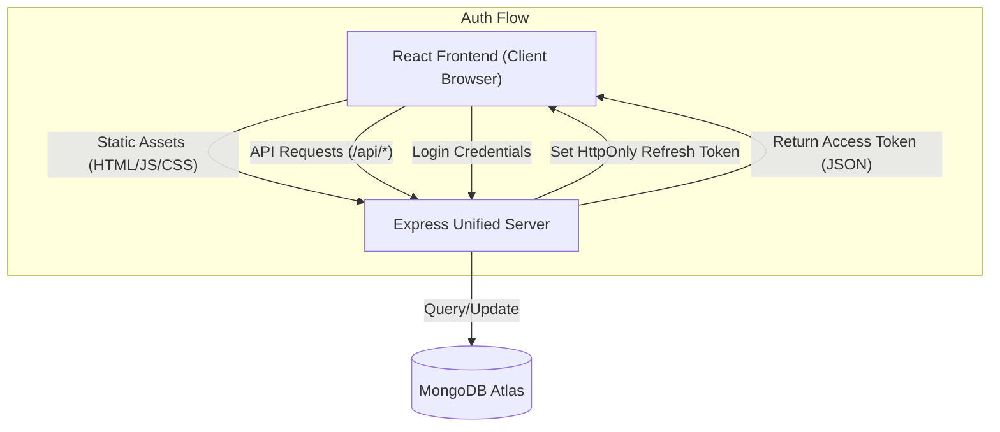

# Project Report: TaskPilot
**Title**: Secure Unified Full-Stack Task Management System  
**Framework**: Node.js, Express, React, MongoDB  

---

## 1. Abstract
TaskPilot is a high-performance, secure, and unified task management application designed to streamline team collaboration. Unlike traditional decoupled architectures, TaskPilot utilizes a unified deployment model where a single Express server handles both RESTful API requests and static frontend serving. The system implements advanced security protocols, including JWT-based authentication with silent refresh tokens and Role-Based Access Control (RBAC), ensuring production-level robustness and data integrity.

## 2. Problem Statement
Many productivity tools suffer from complex deployment overhead, security vulnerabilities in token management (XSS/CSRF), and fragmented architectures that increase latency. There is a need for a "lean" yet secure task management system that can be deployed as a single unit while maintaining strict access controls and real-time performance.

## 3. Objectives
- **Architecture Unification**: Consolidate frontend and backend into a single deployable unit.
- **Security Engineering**: Implement HttpOnly cookie-based refresh tokens to mitigate XSS.
- **Access Control**: Enforce granular RBAC (Admin/User) across all API endpoints.
- **Production Hardening**: Integrate headers protection (Helmet) and request throttling (Rate-Limit).
- **Efficiency**: Leverage React Query for optimized state synchronization and caching.

## 4. Technology Stack
- **Frontend**: React.js (Vite), Tailwind CSS, React-Router-DOM, Lucide Icons.
- **Backend**: Node.js, Express.js.
- **Database**: MongoDB (Mongoose ODM).
- **Security**: jsonwebtoken, bcryptjs, helmet, express-rate-limit.
- **Deployment**: Railway / Render (Unified Build).

## 5. System Architecture

## 6. Module Description
- **Authentication Module**: Manages registration, login, and secure session persistence via dual-token strategy.
- **Task Management**: Implements full CRUD operations with priority and status tracking.
- **AI Insights**: (Extension) Aggregates task data for productivity recommendations.
- **UI/UX**: Responsive dashboard built with shadcn components for a premium feel.

## 7. Security Architecture
- **JWT Mechanism**: Short-lived Access Tokens (15m) + Long-lived Refresh Tokens (7d).
- **Refresh Flow**: Axios interceptors detect 401s and perform silent re-authentication via the `/refresh` endpoint.
- **Middleware**: Custom `protect` and `authorize` middlewares ensure only authenticated users with correct roles access sensitive data.
- **Hardening**: Helmet hides server signatures; Rate-limit prevents brute-force.

## 8. Deployment Strategy
- **Production Build**: Frontend is compiled into minified assets using `vite build`.
- **Catch-all Routing**: Express handles client-side routing by serving `index.html` for all non-API paths.
- **CI/CD**: Automatic deployment via Railway connected to the source repository.

## 9. Testing & Verification
- **Functional Testing**: Verified Task CRUD, login/logout, and RBAC via browser and cURL.
- **Security Testing**: Verified header suppression and 429 Rate-Limit triggers.
- **Integration Testing**: Confirmed React Router persistence on page refresh.

## 10. Conclusion & Future Scope
TaskPilot successfully demonstrates that a unified full-stack architecture can be both high-performance and extremely secure. 
**Future Scope**:
- WebSocket integration for real-time collaborative editing.
- Advanced AI-driven task auto-assignment based on team workload.
- Mobile application parity using React Native.
